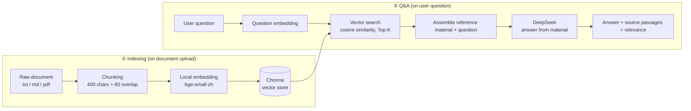

**English** | [简体中文](./README.md)

# RAG Knowledge-Base Q&A System

> Turn any document (txt / md / pdf) into an AI Q&A bot that **answers strictly from your material and never makes things up**.
> Upload a manual → ask a question → the AI answers based on the document and cites its sources; ask about anything outside the material and it honestly replies "I can't answer that."


**Use cases**: enterprise knowledge-base Q&A, support automation, product-manual / SOP Q&A, internal-policy Q&A.

---

## Core Features

Two things kill an AI support bot: **wrong answers** and **confident hallucinations**. This project tackles both head-on with RAG (Retrieval-Augmented Generation):

| Feature | How | Value |
| --- | --- | --- |
| **Accurate answers (with sources)** | Retrieve the most relevant passages from the documents first, then have the LLM answer from them — returning the source passages and their relevance scores alongside the answer | Answers are traceable and verifiable, not a black box |
| **No hallucination (says "I can't answer" for out-of-scope questions)** | A system prompt forces the model to "answer only from the reference material and admit it when the answer isn't there," paired with low-temperature sampling | Eliminates hallucination, safe to drop into support scenarios |

### In-scope vs out-of-scope: the same document, different behavior

Using the sample document *Stellar Tech Employee Handbook* as an example:

| Question | In the document? | Behavior |
| --- | --- | --- |
| "How many days of annual leave?" | ✅ Yes | Accurate answer, with cited source passage and relevance score |
| "Above what amount does a reimbursement need department-head approval?" | ✅ Yes | Accurately answers the exact threshold |
| "Where is the company listed?" | ❌ No | Replies "Based on the available material, I can't answer this question." |
| "What is the CEO's salary?" | ❌ No | Refuses to fabricate, clearly states there's no relevant info in the material |

---

## Demo


1. Upload `示例文档-星辰科技员工手册.md`; the "Indexed documents" list on the left refreshes.
2. Ask an in-document question (e.g. "How many days of annual leave?"): get an accurate answer, with the source passage and relevance score shown below.
3. Ask an out-of-document question (e.g. "Where is the company listed?"): get "Based on the available material, I can't answer this question."

---

## Architecture / RAG Flow



---

## Quick Start

### 1. Get a DeepSeek key

Create an API key at [platform.deepseek.com](https://platform.deepseek.com/). Copy `.env.example` to `.env` and fill in the key:

```bash
cp .env.example .env
# Edit .env: DEEPSEEK_API_KEY=sk-your-key
```

### 2. Install dependencies and run (uv)

```bash
uv venv --python 3.12
uv pip install -r requirements.txt
uv run uvicorn app.main:app --reload
```

> The embedding model (~100MB) downloads automatically on first launch.

### 3. Open the browser

Go to <http://127.0.0.1:8000>, upload `示例文档-星辰科技员工手册.md`, and start asking.

---

## Engineering Notes: Local Embedding + Domestic Mirror

- **Local embedding (`bge-small-zh-v1.5`)**: vectorization runs on the local machine — no paid embedding API call per chunk, lower cost, and data never leaves the box (knowledge bases often involve internal material that's sensitive to outbound transfer). It also outperforms most general-purpose English models on Chinese retrieval.
- **Domestic mirror (`hf-mirror.com`)**: downloading models directly from `huggingface.co` often times out, so the code sets `HF_ENDPOINT` to the mirror **before** importing `transformers` (the order matters — set it too late and it won't take effect).

---

## Project Structure

```text
rag-demo/
├── app/
│   ├── main.py            # FastAPI endpoints + serves the frontend
│   ├── rag.py             # RAG core: chunk → embed → retrieve → generate
│   └── static/index.html  # Frontend page (vanilla HTML/JS, no build step)
├── data/
│   ├── docs/              # Uploaded raw documents
│   └── chroma/            # Vector store (auto-generated)
├── 示例文档-星辰科技员工手册.md
├── requirements.txt
├── .env.example
├── LICENSE
└── README.md
```

## Tech Stack

| Layer | Choice | Notes |
| --- | --- | --- |
| Backend | **FastAPI** | Lightweight async web framework with built-in OpenAPI docs |
| LLM | **DeepSeek** (`deepseek-chat`) | Called via the OpenAI-compatible API to generate the final answer |
| Embedding | **bge-small-zh-v1.5** (local) | Chinese semantic embedding, no API key, data stays local |
| Vector store | **Chroma** (local, persistent) | Stored as files on disk, no separate database service to deploy |
| Frontend | Vanilla HTML / JS | Single-file page, zero build dependencies |

## Roadmap

- Integrate with WeChat Official Accounts / WeCom / Feishu bots
- Support more formats: Word, Excel, web scraping
- Multi-turn conversation memory and chat history
- Source highlighting with jump-back to the original location
- Streaming output (SSE) and retrieval reranking for higher precision

---

## License

[MIT](./LICENSE) © Sunruising
