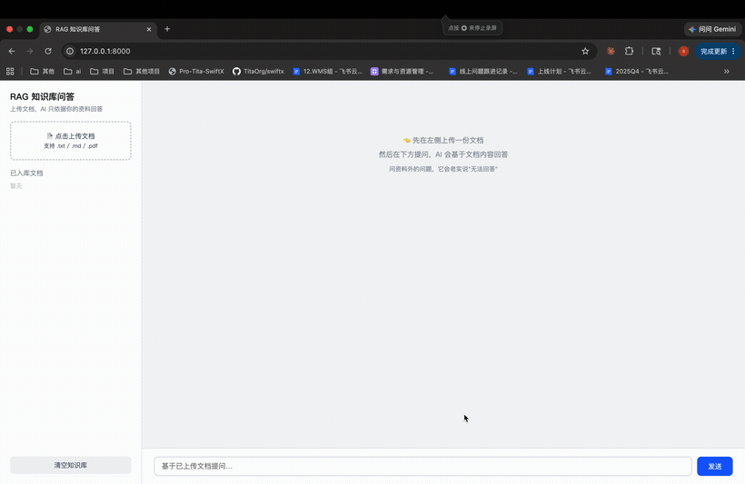
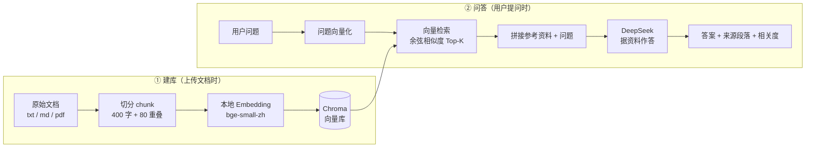

# RAG 知识库问答系统

> 把任意文档（txt / md / pdf）变成一个**只依据你的资料回答、不瞎编**的 AI 问答机器人。
> 上传一份手册 → 提问 → AI 基于文档内容作答并标注来源；问到资料外的内容，会老实回答「无法回答」。


**适用场景**：企业知识库问答、智能客服、产品手册 / 操作文档问答、公司内部制度问答。

---

## 核心特性

落地 AI 客服最怕两件事：**答不准** 和 **一本正经地胡说八道**。本项目用 RAG（检索增强生成）正面解决这两点：

| 特性 | 做法 | 价值 |
| --- | --- | --- |
| **答得准（带来源）** | 先在文档里检索最相关的段落，再让大模型据此回答，并把依据的来源段落 + 相关度一起返回 | 答案可追溯、可核对，不是黑盒 |
| **不瞎编（资料外答"无法回答"）** | 系统提示强制「只能依据参考资料回答，资料里没有就如实说不知道」，并配合低温度采样 | 杜绝幻觉，可放心接入客服场景 |

### 问内 vs 问外：同一份文档的不同表现

以示例文档《星辰科技员工手册》为例：

| 提问 | 文档里有吗 | 表现 |
| --- | --- | --- |
| 「年假有几天？」 | ✅ 有 | 准确回答，并标注来源段落与相关度 |
| 「报销超过多少要部门负责人审批？」 | ✅ 有 | 准确回答具体金额阈值 |
| 「公司在哪上市？」 | ❌ 没有 | 回答「根据现有资料，我无法回答这个问题。」 |
| 「CEO 的薪资是多少？」 | ❌ 没有 | 拒绝编造，明确说明资料中无相关信息 |

---

## 演示



1. 上传 `示例文档-星辰科技员工手册.md`，左侧「已入库文档」刷新。
2. 提问文档内的问题（如「年假有几天？」）：返回准确答案，并在下方标注来源段落与相关度。
3. 提问文档外的问题（如「公司在哪上市？」）：返回「根据现有资料，我无法回答这个问题。」

---

## 架构 / RAG 流程



---

## 快速开始

### 1. 准备 DeepSeek Key

去 [platform.deepseek.com](https://platform.deepseek.com/) 创建 API key。把 `.env.example` 复制成 `.env`，填入 key：

```bash
cp .env.example .env
# 编辑 .env：DEEPSEEK_API_KEY=sk-你的key
```

### 2. 装依赖 + 启动（uv）

```bash
uv venv --python 3.12
uv pip install -r requirements.txt
uv run uvicorn app.main:app --reload
```

> 首次启动会自动下载 embedding 模型（约 100MB）。

### 3. 打开浏览器

访问 <http://127.0.0.1:8000>，上传 `示例文档-星辰科技员工手册.md` 后即可提问。

---

## 工程说明：本地 Embedding + 国内镜像

- **本地 Embedding（`bge-small-zh-v1.5`）**：向量化在本机完成，无需为每段文字调用付费 Embedding API，省成本、数据不出本地（知识库常涉及内部资料，对数据外发敏感）；中文检索效果也优于多数通用英文模型。
- **国内镜像（`hf-mirror.com`）**：直连 `huggingface.co` 下载模型常超时失败，代码在 import `transformers` **之前**设置 `HF_ENDPOINT` 走镜像（顺序很关键，晚了不生效）。

---

## 目录结构

```text
rag-demo/
├── app/
│   ├── main.py            # FastAPI 接口 + 托管前端
│   ├── rag.py             # RAG 核心：切分 → 向量化 → 检索 → 生成
│   └── static/index.html  # 前端页面（原生 HTML/JS，无需构建）
├── data/
│   ├── docs/              # 上传的原始文档
│   └── chroma/            # 向量库（自动生成）
├── 示例文档-星辰科技员工手册.md
├── requirements.txt
├── .env.example
├── LICENSE
└── README.md
```

## 技术栈

| 层 | 选型 | 说明 |
| --- | --- | --- |
| 后端 | **FastAPI** | 轻量异步 Web 框架，自带 OpenAPI 文档 |
| 大模型 | **DeepSeek**（`deepseek-chat`） | 通过 OpenAI 兼容接口调用，生成最终答案 |
| Embedding | **bge-small-zh-v1.5**（本地） | 中文语义向量化，免 API key、数据不出本地 |
| 向量库 | **Chroma**（本地持久化） | 文件形式存盘，无需单独部署数据库服务 |
| 前端 | 原生 HTML / JS | 单文件页面，零构建依赖 |

## 可拓展方向

- 接入微信公众号 / 企业微信 / 飞书机器人
- 支持更多格式：Word、Excel、网页抓取
- 多轮对话记忆与对话历史
- 来源高亮，跳转回原文位置
- 流式输出（SSE）、检索重排序（rerank）提升精度

---

## English Summary

A **RAG (Retrieval-Augmented Generation)** knowledge-base Q&A system.
Upload any `txt / md / pdf` document, then ask questions — the assistant answers **strictly based on your documents** and **cites the source passages it relied on**. When the answer is not in the documents, it honestly replies "I cannot answer based on the available material" instead of hallucinating.

Stack: **FastAPI** + **DeepSeek** (LLM) + local **bge-small-zh** embeddings + **Chroma** vector store. Embeddings run locally (no per-call cost, data stays on-prem), with a domestic Hugging Face mirror configured for reliable model download in mainland China.

---

## License

[MIT](./LICENSE) © Sunruising
